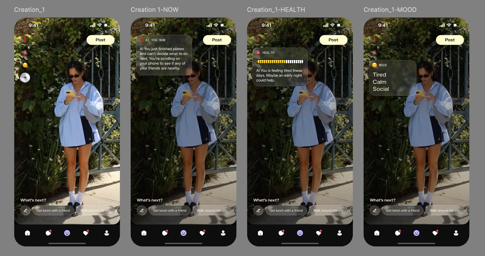

### 1. 🎯 项目概述 (已更新)

 **目标** ：开发一个 Demo，用于展示一个 AI 角色的多个“实时状态”，并允许用户通过 `Mood` 菜单进行切换。

 **核心体验** ：

1. **前端 (App)** ：



* **核心视图** ：App 启动时加载一个 AI 角色的 **默认 `Status`** 。
* **手势 1 (点击左上角 `[MOOD]`)** : 用户点击 `[MOOD: Tired]` 按钮， **展开一个菜单浮层** 。此浮层列出了该 AI 角色的 **所有其他 `Status`** （通过它们的 `Mood` 或 `Title` 显示）。用户点击菜单中的另一项（例如 "Energetic"）， **整个视图将切换到对应的 `Status`** 。
* **手势 2 (点击 `[NOW]` / `[HEALTH]`)** : 在**当前** `Status` 内部，用户点击 `[NOW]` 或 `[HEALTH]` 按钮来**展开/折叠**信息图层。
* **背景 (自动)** ：在**当前** `Status` 视图中，背景视频会按列表**自动、顺序、无限循环**播放。

1. **后端 (Admin)** ：

* 管理员可以独立创建 `AI Characters` 及其 `Assets` 和 `System Prompts`。
* 管理员可以为**一个** `AI Character` 创建**多个** `Status`（例如，一个 `Mood` 为 "Tired" 的 Status，一个 `Mood` 为 "Energetic" 的 Status）。
* 每个 `Status` 都通过 Gen-AI 工作流独立生成其内容（视频、图层文本等）。

---

### 2. 🏛️ 数据库设计 (Supabase)

数据库结构保持不变（4 个独立表格）。这个设计**已经支持**一个 `ai_character` 拥有多个 `character_statuses`，完美契合新的切换需求。

**Code snippet**

```
+---------------------------+      +---------------------------+
| ai_characters (NEW)       |      | character_assets (Global) |
| (独立的角色表)              |      | (全局资产库)              |
|---------------------------|      |---------------------------|
| character_id (PK, uuid)   |      | asset_id (PK)             |
| name (text)               |      | asset_name (text)         |
| avatar_url (text)         |      | asset_type ('服饰','地点')|
+---------------------------+      | image_url (text, 上传)    |
        |                            +---------------------------+
        +----------------------------+
        | 1..* (一个 AI 有多个 Status) |
        v                            v
+-----------------------------+    +---------------------------+
| character_statuses          |    | system_prompts            |
| (核心状态表 - 反规范化)       |    | (全局 Prompt 管理)        |
|-----------------------------|    |---------------------------|
| status_id (PK)              |    | prompt_id (PK, uuid)      |
| character_id (FK) ----------+    | prompt_name (text)        |
| title (Internal)            |    |  (e.g., "IMAGE_GEN")      |
| mood (text)                 |    | prompt_content (text)     |
|                             |    +---------------------------+
| (Gen-AI 核心输入)           |
| status_description (text)   |
| selected_asset_ids (uuid[]) |
|                             |
| (Gen-AI 核心输出)           |
| starting_image_url (text)   |
| videos_playlist (jsonb)     |
|   -> [{"url": "...", "prompt": "..."}, ...]
|                             |
| overlays_content (jsonb)    |
|   -> {"now": ..., "health": ...}
|                             |
| suggestions_list (text[])   |
+-----------------------------+
```

---

### 3. 🖥️ 后端管理平台 - 交互逻辑

后台逻辑基本不变，因为它已经支持“一对多”（一个 Character 对应多个 Status）的管理。

**P1: AI Character 管理**

* **功能** : 对 `ai_characters` 表进行简单的 CRUD。

**P4: 全局 Asset 管理**

* **功能** : 管理 `character_assets` 表。

**P3: System Prompt 管理**

* **功能** : 管理 `system_prompts` 表。

**P2: Status 管理**

* **功能** : 核心 Gen-AI 工作流， **此页面是创建多个 `Status` 的地方** 。
* **逻辑** : 管理员通过此页面，为选定的 "Alex" 创建**多个** `Status` 条目。

**Code snippet**

```
+-------------------------------------------------------------+
| P2: Status 管理                                             |
+-------------------------------------------------------------+
|  选择 AI Character:  ( Alex   v )  <-- (来自 P1 的列表)     |
|-------------------------------------------------------------|
|  "Alex" 的 Statuses: (前端将通过点击 Mood 在这些之间切换)   |
|                                                             |
|  Mood    | 内部标题       | 操作                           |
|----------|----------------|--------------------------------|
| "Tired"  | "刚健完身"     | [编辑] [删除]                  |
| "Calm"   | "清晨冥想"     | [编辑] [删除]                  |
| "Social" | "准备参加派对" | [编辑] [删除]                  |
|                                                             |
|  [ + 创建一个新的 Status ] (点击进入下面的编辑器)           |
+-------------------------------------------------------------+

(编辑器逻辑不变：管理员在创建时填写 'Mood' 字段，并完成 Gen-AI 工作流)

+-------------------------------------------------------------+
| P2 (续): Status 编辑器 (角色: Alex)                         |
+-------------------------------------------------------------+
| 0. 核心输入                                                 |
| 内部标题: [ 刚健完身 ]                                        |
| Mood:     [ Tired ] <--- (这个字段将显示在前端菜单中)       |
| 状态描述: [ (Alex 刚做完 1 小时普拉提...) ]                 |
| ... (Gen-AI 工作流) ...                                     |
| [ (一键保存 Status) ]                                       |
+-------------------------------------------------------------+
```

---

### 4. 📱 前端 App - 交互逻辑

#### A. 核心交互图 (已更新)

此图展示了全新的、由 `[MOOD]` 按钮驱动的 `Status` 切换流程。

**Code snippet**

```
    (初始状态: 加载 "刚健完身" Status)
+---------------------------------------+
|  [MOOD: Tired]  <-- (1. 用户点击这里) |
|                                       |
|         ( 视频 A 正在播放... )         |  <-- (自动轮播)
|                                       |
|  [NOW]    [HEALTH]                    |  <-- (点击可展开)
|                                       |
|  [ Get lunch... ] [ Walk around... ]  |
+---------------------------------------+
                |
                v
    (浮层展开: 显示 "Alex" 的所有 Status)
+---------------------------------------+
|  [MOOD: Tired]  <-- (当前)            |
|  +---------------------------------+  |
|  | (o) Tired  (刚健完身)           |  |
|  | ( ) Calm   (清晨冥想) <--(2. 用户点击) |
|  | ( ) Social (准备参加派对)        |  |
|  +---------------------------------+  |
|                                       |
|  [NOW]    [HEALTH]                    |
+---------------------------------------+
                |
                v
    (视图重置: 加载 "清晨冥想" Status)
+---------------------------------------+
|  [MOOD: Calm]   <-- (UI 更新)         |
|                                       |
|         ( "清晨" 视频 1 开始播放... )  |  <-- (新视频列表)
|                                       |
|  [NOW]    [HEALTH]                    |  <-- (图层重置为折叠)
|                                       |
|  [ Take a deep... ] [ Meditate... ]  |  <-- (新建议)
+---------------------------------------+
```

#### B. 交互逻辑说明 (已更新)

1. **应用加载** :

* App 启动，获取**一个** AI Character (`character_id`) 的**所有** `character_statuses` 列表。
* 默认加载列表中的**第一个** `Status`（例如 `Mood: Tired`）。

1. **交互 1: 切换 Status (点击 `[MOOD]` 菜单)**
   * **手势** : 用户点击屏幕左上角的 `[MOOD: Tired]` 按钮。
   * **响应** : 一个菜单浮层展开，显示**所有**已加载的 `Status` 列表（通过 `mood` 或 `title` 字段显示）。
   * **手势 (续)** : 用户点击菜单中的一个**新**选项（例如 `[Calm]`）。
   * **响应 (视图重置)** : 浮层关闭。App **卸载**当前 Status 的所有数据，并**加载**所选 `Status` 的数据。
   * **视频** : `videos_playlist` 被替换，并从第 1 个视频开始播放。
   * **图层** : `[NOW]` 和 `[HEALTH]` 重置为折叠状态，其内容更新为新 Status 的内容。
   * **建议** : `suggestions_list` 被替换为新 Status 的建议。
   * **UI** : 左上角的 `[MOOD]` 按钮文本更新为 `[MOOD: Calm]`。
2. **交互 2: 展开图层 (点击 `[NOW]` / `[HEALTH]`)**
   * **手势** : 用户点击 `[NOW]` 或 `[HEALTH]` 按钮/热区。
   * **响应** : 在**当前** `Status` 下，对应的图层信息展开/折叠。
   * **不变** : 此操作**不会**触发 Status 切换。
3. **交互 3: 视频轮播 (自动)**
   * **触发** : **当前** `Status` 的 `videos_playlist` 中的视频播放完毕。
   * **响应** : 自动加载并播放该列表中的**下一个**视频， **无限循环** 。
   * **不变** : 此操作**不会**触发 Status 切换。
